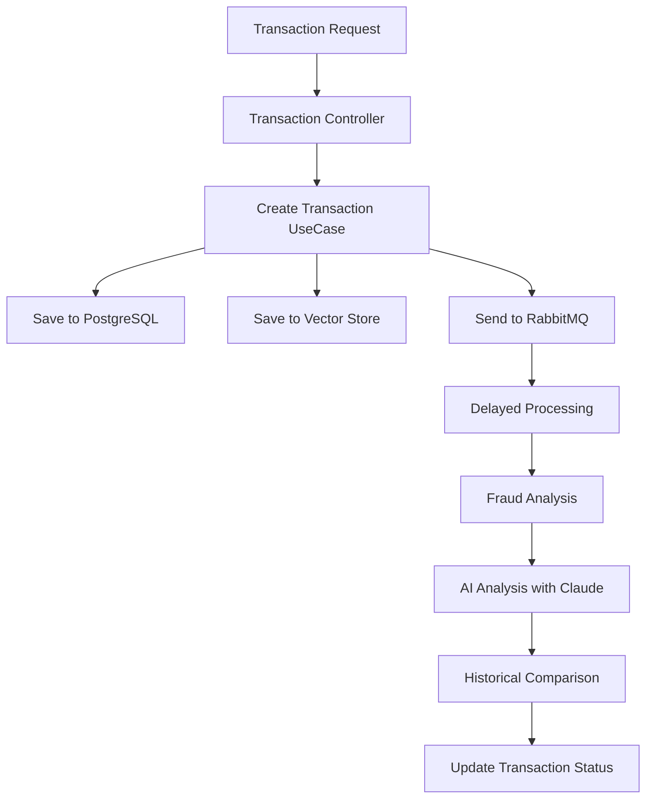

# 🔒 Fraud Analyze - Sistema Inteligente de Detecção de Fraudes

[](https://kotlinlang.org/)
[](https://spring.io/projects/spring-boot)
[](https://spring.io/projects/spring-ai)
[](https://openjdk.java.net/projects/jdk/21/)
[](LICENSE)

Sistema avançado de detecção de fraudes em transações financeiras utilizando **Inteligência Artificial**, **Vector Store** e **processamento assíncrono**. Combina **Spring AI** com **Anthropic Claude**, **Qdrant Vector Database** e **RabbitMQ** para análise comportamental em tempo real.

## 🚀 Características Principais

- **🤖 IA Avançada**: Integração com Anthropic Claude para análise comportamental
- **🔍 Vector Search**: Busca semântica por padrões históricos usando Qdrant
- **⚡ Processamento Assíncrono**: RabbitMQ com delay inteligente para análises
- **🏗️ Arquitetura Hexagonal**: Clean Architecture com separação de responsabilidades
- **📊 Análise Contextual**: Comparação com histórico comportamental do cliente
- **🛡️ Resiliente**: Circuit breaker patterns e tratamento robusto de erros
- **📈 Observabilidade**: Métricas Prometheus e tracing OpenTelemetry

## 🛠️ Stack Tecnológica

### **Backend**
- **Kotlin** 1.9.25 + **Spring Boot** 3.5.3
- **Spring AI** 1.0.0 (Anthropic Claude integration)
- **Spring Data JPA** + **PostgreSQL**
- **RabbitMQ** (mensageria assíncrona)
- **Qdrant** (Vector Database)

### **Infraestrutura**
- **Docker Compose** (ambiente de desenvolvimento)
- **Flyway** (versionamento de schema)
- **Micrometer** + **Prometheus** (métricas)
- **OpenTelemetry** (distributed tracing)

### **Qualidade**
- **Kotlin Logging** (estruturado)
- **Bean Validation** (validação de entrada)
- **Gradle** (build automation)

## 📋 Pré-requisitos

- **Java 21+**
- **Docker** e **Docker Compose**
- **Gradle 8.14+**
- **Chave API Anthropic Claude**

## ⚡ Quick Start

### 1. **Clone o repositório**
```bash
git clone https://github.com/fabriciolfj/analyze-transaction-fraud.git
cd analyze-transaction-fraud
```

### 2. **Configure as variáveis de ambiente**
```bash
# Crie um arquivo .env
echo "KEY=sua_chave_anthropic_aqui" > .env
```

### 3. **Inicie a infraestrutura**
```bash
# Sobe PostgreSQL, RabbitMQ, Qdrant e PgAdmin
docker-compose up -d
```

### 4. **Execute a aplicação**
```bash
# Via Gradle
./gradlew bootRun

# Ou compile e execute
./gradlew build
java -jar build/libs/fraud-analyze-0.0.1-SNAPSHOT.jar
```

### 5. **Teste a API**
```bash
curl -X POST http://localhost:8080/api/v1/transactions \
  -H "Content-Type: application/json" \
  -d '{
    "customerId": "customer-123",
    "cardNumber": "4111111111111111",
    "merchantName": "Amazon",
    "amount": 150.00,
    "transactionDate": "2024-01-15 14:30:00",
    "location": "São Paulo, SP"
  }'
```

## 🏗️ Arquitetura do Sistema

### **Fluxo de Processamento**



### **Componentes Principais**

#### **🎯 Domain Layer**
- **Entities**: `Transaction`, `Customer`, `Payment`, `Location`
- **Use Cases**: `CreateTransactionUseCase`, `AnalyseUseCase`
- **Gateways**: Interfaces para adapters externos

#### **🔌 Adapter Layer**
- **Controllers**: REST API endpoints
- **Repositories**: Persistência PostgreSQL
- **Vector Store**: Integração Qdrant
- **Chat Client**: Integração Anthropic Claude
- **Message Queue**: RabbitMQ producers/consumers

#### **📡 Infrastructure**
- **Database**: PostgreSQL com otimizações de índices
- **Vector DB**: Qdrant para busca semântica
- **Message Broker**: RabbitMQ com dead letter queues

## 🔍 Funcionalidades

### **🎯 Detecção Inteligente de Fraudes**

O sistema analisa transações usando múltiplos critérios:

1. **Padrão de Valor**: Compara com média histórica do cliente
2. **Padrão Temporal**: Detecta horários atípicos de transação
3. **Padrão Geográfico**: Identifica localizações suspeitas
4. **Padrão de Merchant**: Analisa tipos de estabelecimentos
5. **Frequência**: Detecta múltiplas transações simultâneas

### **📊 Status de Transações**

- `PENDING`: Aguardando análise
- `APPROVE`: Transação aprovada
- `DENIED`: Transação negada (suspeita de fraude)
- `ANALYSE`: Requer análise manual

### **🔍 Vector Search**

Utiliza embeddings para encontrar padrões similares:
- Busca semântica por comportamento
- Comparação com histórico do cliente
- Análise contextual temporal

## 📚 API Reference

### **Criar Transação**
```http
POST /api/v1/transactions
Content-Type: application/json

{
  "customerId": "string",
  "cardNumber": "string", 
  "merchantName": "string",
  "amount": "decimal",
  "transactionDate": "yyyy-MM-dd HH:mm:ss",
  "location": "string"
}
```

**Response:** `201 Created`

### **Health Check**
```http
GET /actuator/health
```

### **Métricas**
```http
GET /actuator/prometheus
```

## 🐳 Docker Compose Services

```yaml
services:
  postgres:     # PostgreSQL Database
  pgadmin:      # Database Admin Interface
  rabbitmq:     # Message Broker
  qdrant:       # Vector Database
```

**Portas dos Serviços:**
- **Aplicação**: `8080`
- **PostgreSQL**: `5432`
- **PgAdmin**: `8081`
- **RabbitMQ Management**: `15672`
- **Qdrant**: `6333`

## ⚙️ Configuração

### **Environment Variables**

| Variável | Descrição | Obrigatória |
|----------|-----------|-------------|
| `KEY` | Chave API Anthropic Claude | ✅ |
| `SPRING_PROFILES_ACTIVE` | Profile Spring (dev/prod) | ❌ |

### **Application Properties**

```yaml
# Configuração principal
spring:
  ai:
    anthropic:
      api-key: ${KEY}
  datasource:
    url: jdbc:postgresql://localhost:5432/fraud_db
  
# RabbitMQ
rabbitmq:
  analyse:
    queue: analyse-transaction
    dlq: analyse-transaction-dlq
```

## 🧪 Testes

```bash
# Executar todos os testes
./gradlew test

# Executar com coverage
./gradlew test jacocoTestReport

# Testes de integração
./gradlew integrationTest
```

## 📈 Monitoring

### **Métricas Disponíveis**
- Transações processadas
- Tempo de análise de fraude
- Taxa de detecção
- Performance do vector search

### **Logs Estruturados**
```json
{
  "timestamp": "2024-01-15T14:30:00Z",
  "level": "INFO",
  "logger": "com.github.fraudanalyze.domain.usecases",
  "message": "transaction saved customer-123",
  "transactionCode": "uuid-here"
}
```

## 🚀 Deploy

### **Produção**

1. **Configure secrets**:
```bash
export KEY=your_anthropic_key
export DATABASE_URL=your_postgres_url
```

2. **Build da aplicação**:
```bash
./gradlew build
```

3. **Execute com profile de produção**:
```bash
java -jar -Dspring.profiles.active=prod build/libs/fraud-analyze-0.0.1-SNAPSHOT.jar
```

### **Docker**
```bash
# Build da imagem
docker build -t fraud-analyze .

# Execute
docker run -p 8080:8080 -e KEY=your_key fraud-analyze
```

## 🤝 Contribuindo

1. **Fork** o projeto
2. **Crie** uma feature branch (`git checkout -b feature/amazing-feature`)
3. **Commit** suas mudanças (`git commit -m 'feat: add amazing feature'`)
4. **Push** para a branch (`git push origin feature/amazing-feature`)
5. **Abra** um Pull Request

### **Padrões de Commit**
- `feat:` nova funcionalidade
- `fix:` correção de bug
- `docs:` documentação
- `style:` formatação
- `refactor:` refatoração
- `test:` testes

## 📝 Roadmap

- [ ] **Machine Learning**: Modelo próprio de detecção
- [ ] **Real-time Dashboard**: Interface web para monitoramento
- [ ] **Multi-tenancy**: Suporte a múltiplos bancos
- [ ] **A/B Testing**: Comparação de modelos de IA
- [ ] **Kafka Integration**: Processamento de alta escala
- [ ] **GraphQL API**: API mais flexível

## 📄 Licença

Este projeto está licenciado sob a [MIT License](LICENSE).

## 👥 Equipe

- **[fabriciolfj](https://github.com/fabriciolfj)** - Arquiteto & Desenvolvedor Principal

## 🙏 Agradecimentos

- **Anthropic** - Por fornecer o Claude AI
- **Spring Team** - Pelo excelente framework Spring AI
- **Qdrant** - Pela solução de vector database
- **Community** - Por feedback e contribuições

---

<div align="center">

**⭐ Se este projeto foi útil para você, considere dar uma estrela!**

[🐛 Report Bug](https://github.com/fabriciolfj/analyze-transaction-fraud/issues) • [✨ Request Feature](https://github.com/fabriciolfj/analyze-transaction-fraud/issues) • [💬 Discussions](https://github.com/fabriciolfj/analyze-transaction-fraud/discussions)

</div>